# Lava Software Sharing Portal

An internal admin/ODM-facing web portal for managing ODMs (Original Design Manufacturers), Chipsets, and Projects, along with secure file sharing and role-based access control. Built for streamlined software/file distribution workflows within an organization.

## 🚀 Features

- **Role-Based Access Control** — Custom authentication filter (`AuthFilter`) managing admin and ODM-level access without relying on Spring Security defaults
- **ODM Management** — Add, view, and manage ODM (Original Design Manufacturer) profiles
- **Chipset Management** — Chipset-specific routes and dedicated views (Qualcomm, MediaTek, Unisoc, Nvidia, etc.)
- **Project Management** — Create and organize projects linked to ODMs and chipsets
- **File Upload & Storage** — AJAX-based file uploads with real-time progress bars (`XMLHttpRequest`), supporting large files
- **File Operations** — Move, copy, delete, and download files/folders directly from the portal
- **Global Search** — Search across ODMs, chipsets, and projects from a single search bar
- **Forgot/Reset Password** — OTP-based password recovery flow via email (SMTP)
- **Responsive Dashboards** — Separate dashboards for Admin and User roles
- **Dynamic Thymeleaf Templates** — Fully dynamic, data-driven server-rendered views

## 📸 Screenshots

### Authentication
| Login | Forgot Password | Verify OTP                                     | Reset Password |
|---|---|----------------------------------------------------|---|
| 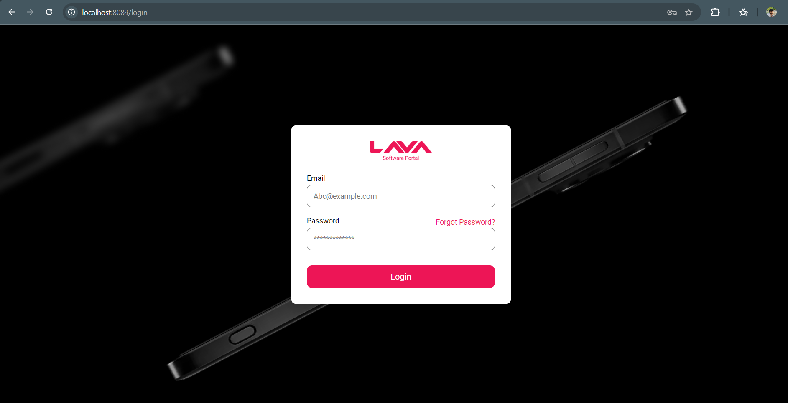 | 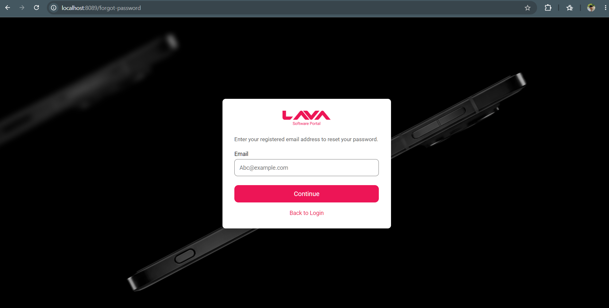 | 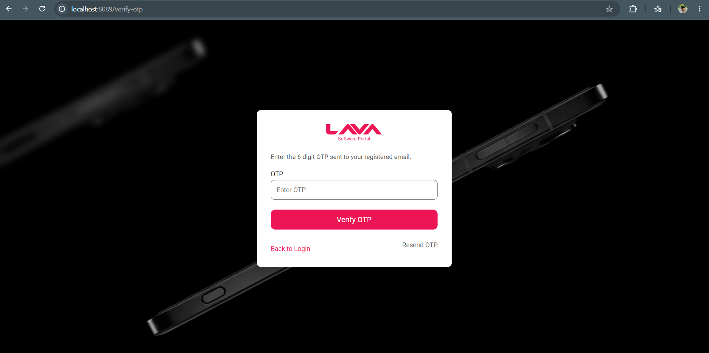 | 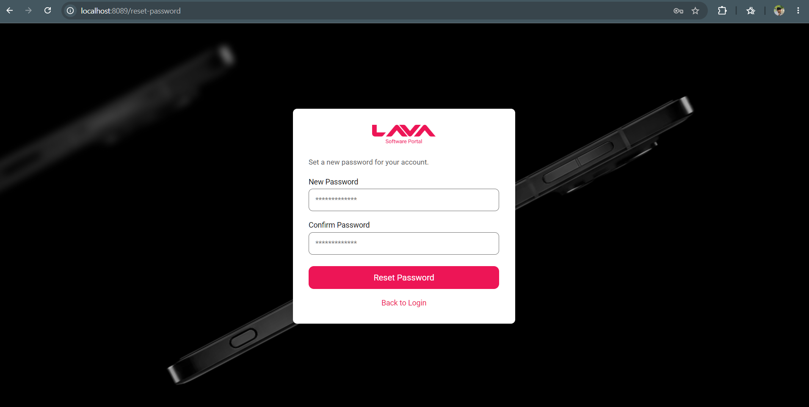 | 

### Dashboards
| Admin Dashboard | User Dashboard |
|---|---|
| 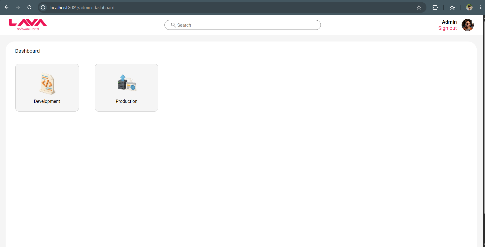 | 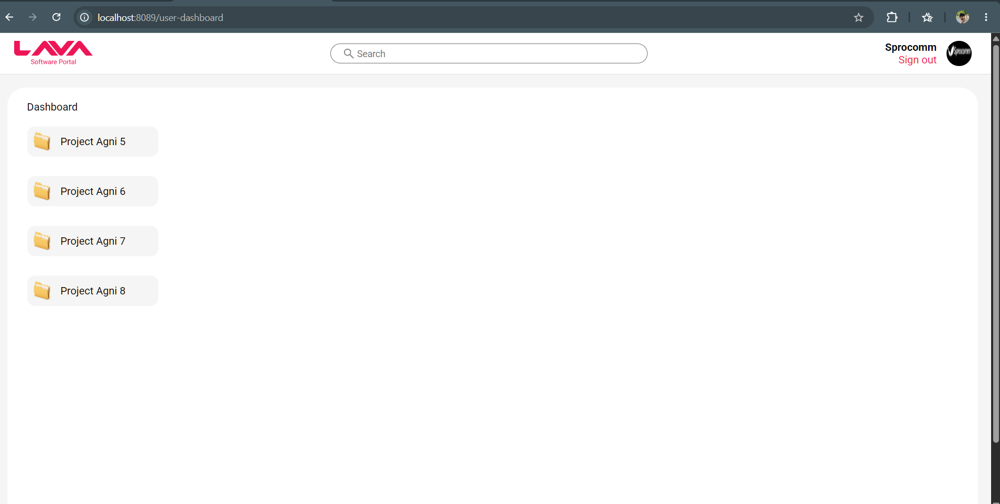 |

### ODM Management
| ODM List | Create ODM | Delete/Rename ODM |
|---|---|---|
| 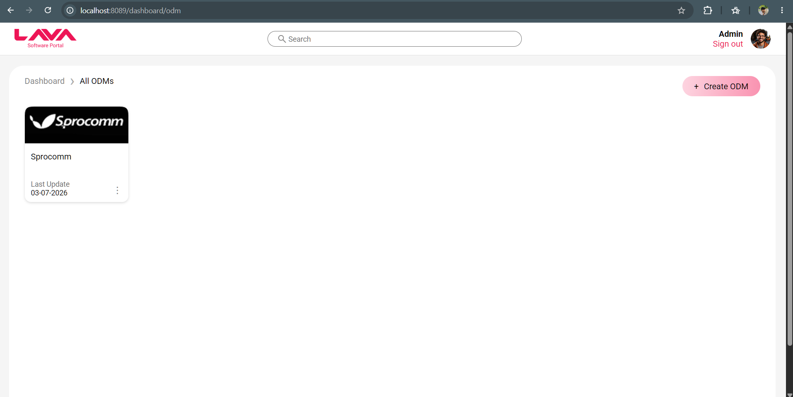 | 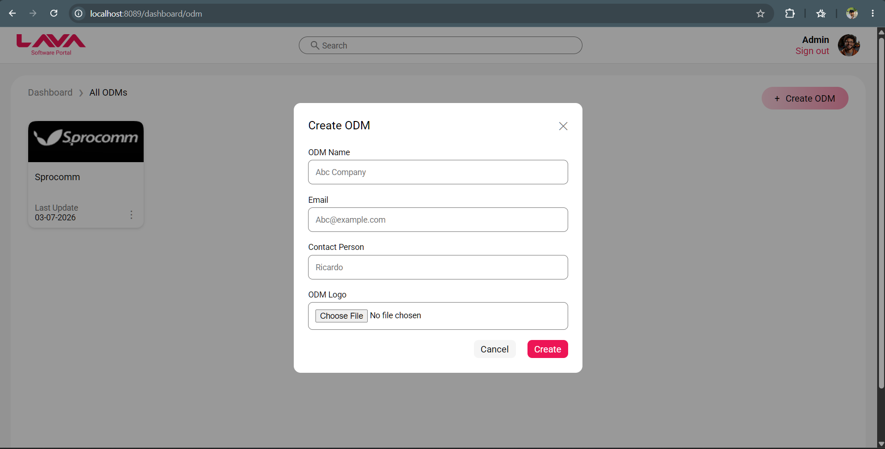 |  |

### Chipset Management
| Chipset List | Chipset → Project View |
|---|---|
| 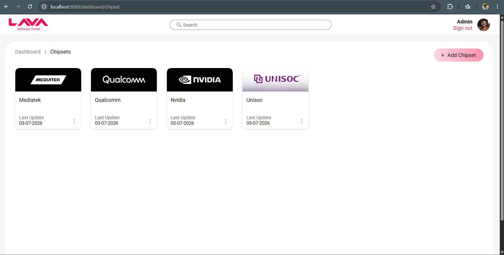 | 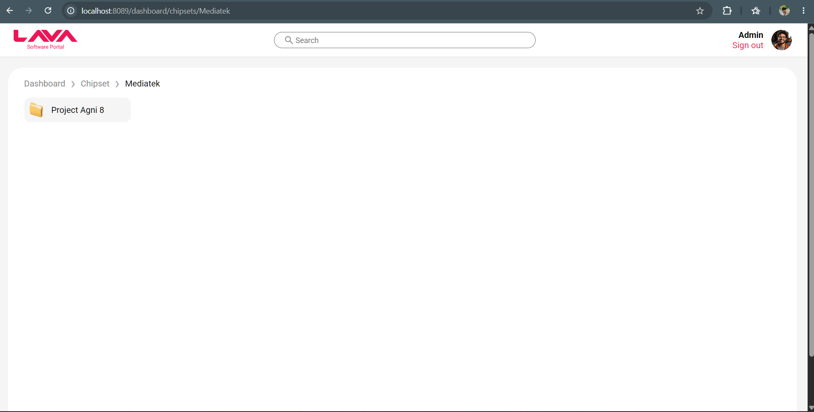 |

### Project Management
| Projects | Create Project | Project Folder View | User Inside Project |
|---|---|---|---|
| 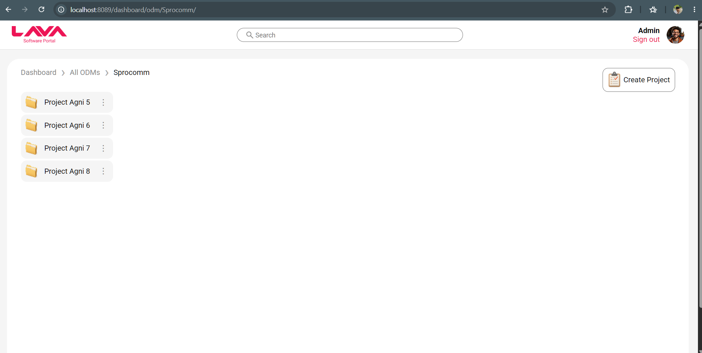 | 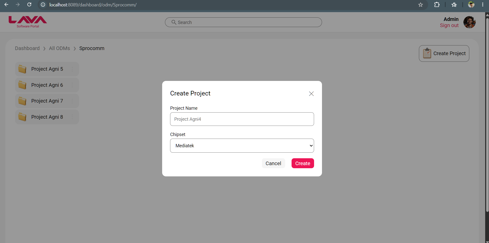 | 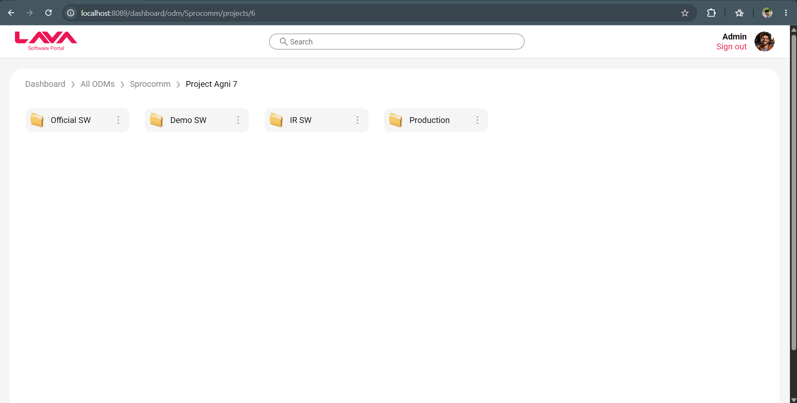 | 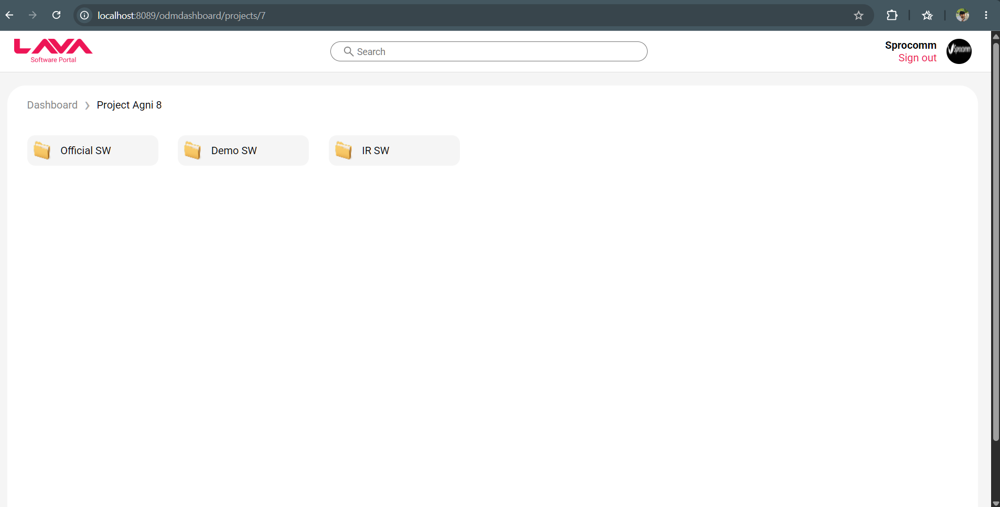 |

### File Management
| Software Files | Upload Software | Upload Progress |
|---|---|---|
| 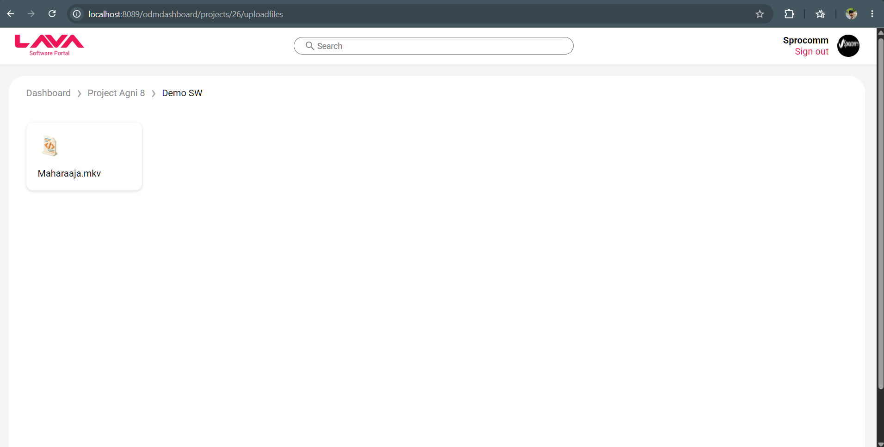 | 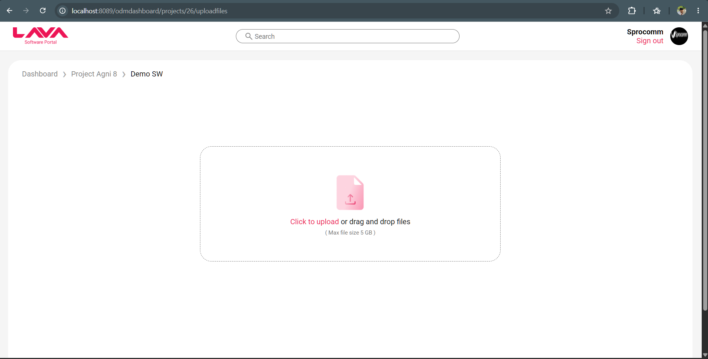 | 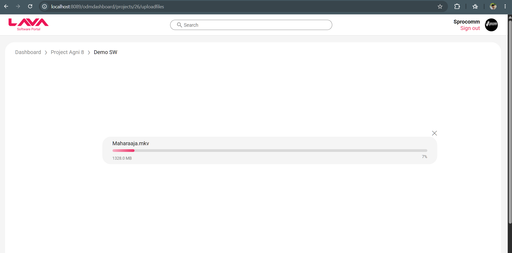 |

### Admin File Browser
| Admin Folder/Files View |
|---|
| 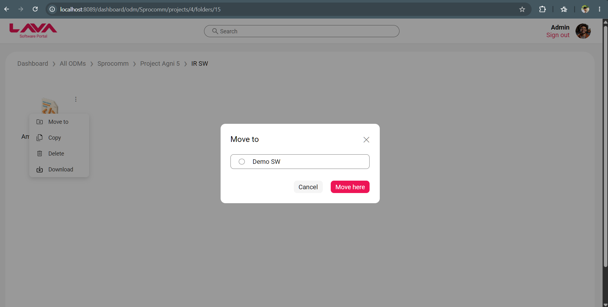 |

## 🛠️ Tech Stack

**Backend**
- Java, Spring Boot
- Spring Data JPA / Hibernate
- MySQL

**Frontend**
- Thymeleaf
- HTML, CSS, JavaScript

**Other**
- Maven (build tool)
- JavaMail (SMTP for OTP emails)
- Custom Servlet Filter-based Authentication

## 📁 Project Structure

```
src/main/java/com/example/loginandregister/
├── config/          # Web configuration
├── controller/      # REST/MVC controllers (ODM, Chipset, Project, User, Search, File)
├── filter/          # Custom AuthFilter for role-based access
├── model/            # Entity classes (User, Odm, Chipset, Project, Folder, FileEntity)
├── repository/      # Spring Data JPA repositories
└── services/         # Business logic (File storage, Email/OTP, ODM, Project, Chipset)

src/main/resources/
├── templates/        # Thymeleaf HTML views
├── static/           # CSS, JS, images
└── application.properties.example   # Config template (no secrets)
```

## ⚙️ Setup & Installation

### Prerequisites
- Java 17+
- Maven
- MySQL Server

### Steps

1. **Clone the repository**
   ```bash
   git clone https://github.com/tripathiaman9354/-Lava-software-sharing-portal.git
   cd -Lava-software-sharing-portal
   ```

2. **Configure application properties**

   Copy the example config and fill in your own values:
   ```bash
   cp src/main/resources/application.properties.example src/main/resources/application.properties
   ```

   Update `application.properties` with:
    - Your MySQL database URL, username, password
    - SMTP email credentials (for OTP-based password reset)

3. **Create the database**
   ```sql
   CREATE DATABASE lava;
   ```

4. **Build and run**
   ```bash
   ./mvnw spring-boot:run
   ```

5. Visit `http://localhost:8089` in your browser.

## 🔒 Security Note

This repository does **not** include `application.properties`, which contains sensitive credentials (DB password, JWT/mail secrets). Use `application.properties.example` as a reference to create your own local config file — it is git-ignored by default.

## 📌 Status

Actively developed. Core modules (ODM, Chipset, Project management, file sharing, authentication) are functional.

## 👤 Author

**Aman Tripathi**
Full Stack Developer (Java/Spring Boot + React.js)